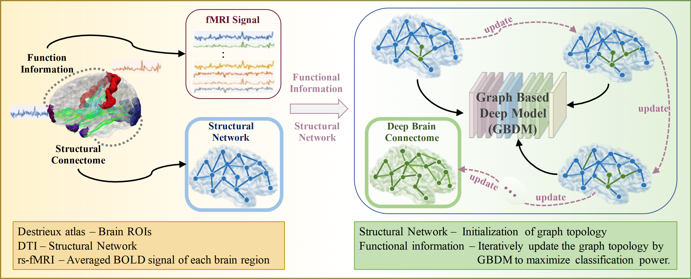

# Deep-fusion-of-brain-structure-function-in-mild-cognitive-impairment
### Framework:

### Papers:
This repository provides a PyTorch implementation of the models adopted in the paper:

- Zhang, L., Wang, L., Gao, J., Risacher, S.L., Yan, J., Li, G., Liu, T., Zhu, D. and Alzheimer’s Disease Neuroimaging Initiative, 2021. Deep fusion of brain structure-function in mild cognitive impairment. Medical image analysis, 72, p.102082.

#### train.py
You need to run this file to start. All the hyper-parameters can be defined in this file.

Run `python ./train_gcn_combined_Adj.py`. 

Tested with:
- PyTorch 1.7.1
- Python 3.6.0

### Data:
We used 252 subjects (132 Normal Controls (NC) and 120 MCI patients) from ADNI dataset in our research. Each subject has all three modalities, including MRI (T1-
weighted), resting state fMRI (rs-fMRI) and DTI. we preprocessed and generated the averaged functional sighnal of each region, structural connectivity (SC), and the functional connectivity (FC) matrices. All of the data can be shared for research purpose. Please contact the author to get the data by sending email to lu.zhang2@mavs.uta.edu.

### Citation:
If you used the code or data of this project,  please cite:

    @article{zhang2021deep,
	  title={Deep fusion of brain structure-function in mild cognitive impairment},
	  author={Zhang, Lu and Wang, Li and Gao, Jean and Risacher, Shannon L and Yan, Jingwen and Li, Gang and Liu, Tianming and Zhu, Dajiang and Alzheimer’s Disease Neuroimaging Initiative and others},
	  journal={Medical image analysis},
	  volume={72},
	  pages={102082},
	  year={2021},
	  publisher={Elsevier}
	}
    

